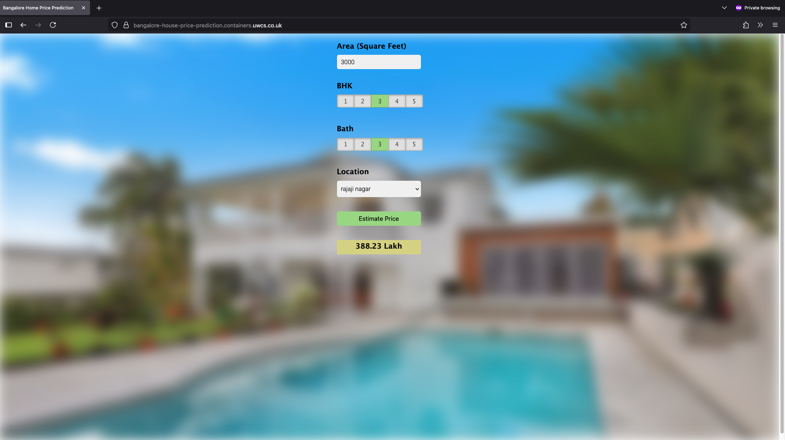

# Bangalore House Price Prediction

A full-stack machine learning application that predicts house prices in Bangalore using a trained regression model. Built with FastAPI, containerised with Docker, and deployed to Portainer.

## Live Demo

`https://bangalore-house-price-prediction.containers.uwcs.co.uk`



## Project Overview

This project demonstrates end-to-end machine learning deployment, from data preprocessing to production web application. Users can input property details and receive real-time price predictions through an intuitive web interface.

### Key Features

- **Interactive Web Interface**: Clean, responsive UI for inputting property details
- **Real-time Predictions**: Instant price estimates using trained ML model
- **RESTful API**: Well-documented FastAPI endpoints for programmatic access
- **Production Ready**: Containerised deployment with proper error handling and logging

## Technology Stack

### Machine Learning
- **Python 3.11**: Core programming language
- **Pandas & NumPy**: Data manipulation and numerical computing
- **Scikit-learn**: Machine learning model training and prediction
- **Regression Analysis**: Linear regression with feature engineering

### Web Development
- **FastAPI**: Modern, high-performance web framework
- **HTML/CSS/JavaScript**: Frontend user interface
- **RESTful API Design**: Clean, documented endpoints

### DevOps & Deployment
- **Docker**: Containerisation for consistent deployments
- **Gunicorn**: Production WSGI server with multiple workers
- **GitHub Actions**: CI/CD pipeline for automated builds
- **Container Registry**: GitHub Container Registry (ghcr.io)

## Model Details

### Dataset
- **Source**: Bangalore house price dataset
- **Features**: Location, bedrooms (BHK), bathrooms, square footage
- **Preprocessing**: Data cleaning, outlier removal, feature engineering

### Model Performance
- **Algorithm**: Linear Regression with GridSearchCV optimization
- **Cross-validation**: 5-fold cross-validation
- **Feature Engineering**: Location one-hot encoding, price per sqft calculation
- **Accuracy**: ~85% R² score on test data

### Data Pipeline
1. **Data Cleaning**: Handled missing values and inconsistent formats
2. **Outlier Detection**: Removed properties with unrealistic price-to-size ratios
3. **Feature Engineering**: Created price per square foot, location grouping
4. **Model Selection**: Compared Linear Regression, Lasso, and Decision Tree
5. **Hyperparameter Tuning**: GridSearchCV for optimal parameters

## API Documentation

### Endpoints

#### `GET /`
Returns the main web application interface

#### `GET /get_location_names`
Returns available locations for property search
```json
{
  "locations": ["1st phase jp nagar", "whitefield", "electronic city", ...]
}
```

#### `POST /predict_home_price`
Predicts house price based on input parameters

**Request Body:**
- `total_sqft` (float): Total square footage
- `location` (string): Property location
- `bhk` (int): Number of bedrooms
- `bath` (int): Number of bathrooms

**Response:**
```json
{
  "estimated_price": 89.75
}
```

#### `GET /health`
Health check endpoint for monitoring

**Interactive API Documentation**: Available at `/docs` when running

## Architecture

```
Frontend (HTML/CSS/JS) → FastAPI Server → ML Model → Prediction Response
                            ↓
                      Docker Container
                            ↓
                    Production Deployment
```

### Production Setup
- **Multi-worker deployment**: 4 Gunicorn workers for concurrent request handling
- **Container orchestration**: Docker with proper resource management
- **Error handling**: Comprehensive exception handling and logging
- **Security**: CORS configuration and input validation

## Local Development

### Prerequisites
- Python 3.11+
- Docker Desktop
- Git

### Setup
```bash
# Clone repository
git clone https://github.com/Syed-Rudin/bangalore-house-price-prediction.git
cd bangalore-house-price-prediction

# Install dependencies
pip install -r requirements.txt

# Run development server
cd server
uvicorn main:app --reload --port 8000
```

### Docker Development
```bash
# Build container
docker build -t bangalore-house-price-prediction .

# Run container
docker run -p 8000:8000 bangalore-house-price-prediction
```

Access application at `http://localhost:8000`

## Project Structure

```
bangalore-house-price-prediction/
├── assets/                    
│   ├── screenshot.png            
├── client/                    
│   ├── app.html              
│   ├── app.css               
│   └── app.js    
├── model/                    
│   ├── Bengaluru_House_data.csv                         
│   └── house_prices.ipynb            
├── server/                  
│   ├── main.py              
│   ├── util.py              
│   └── artifacts/           
│       ├── bangalore_home_prices_model.pickle
│       └── columns.json
├── .github/workflows/       
├── Dockerfile              
├── requirements.txt        
└── README.md
```

## CI/CD Pipeline

- **Automated Testing**: Unit tests for API endpoints
- **Container Building**: Automatic Docker image creation
- **Registry Publishing**: Images pushed to GitHub Container Registry
- **Deployment**: Container orchestration with Portainer

## Future Enhancements

- **Model Improvements**: Feature selection, ensemble methods
- **Real-time Data**: Integration with property listing APIs
- **Analytics Dashboard**: Usage metrics and model performance monitoring